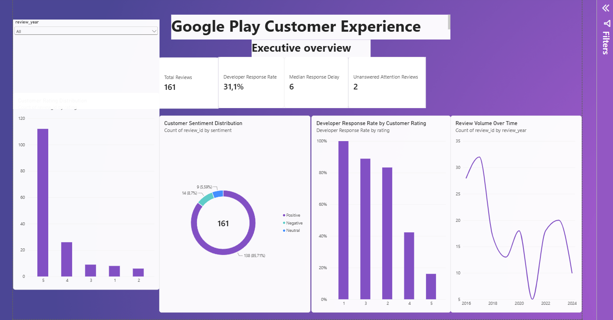
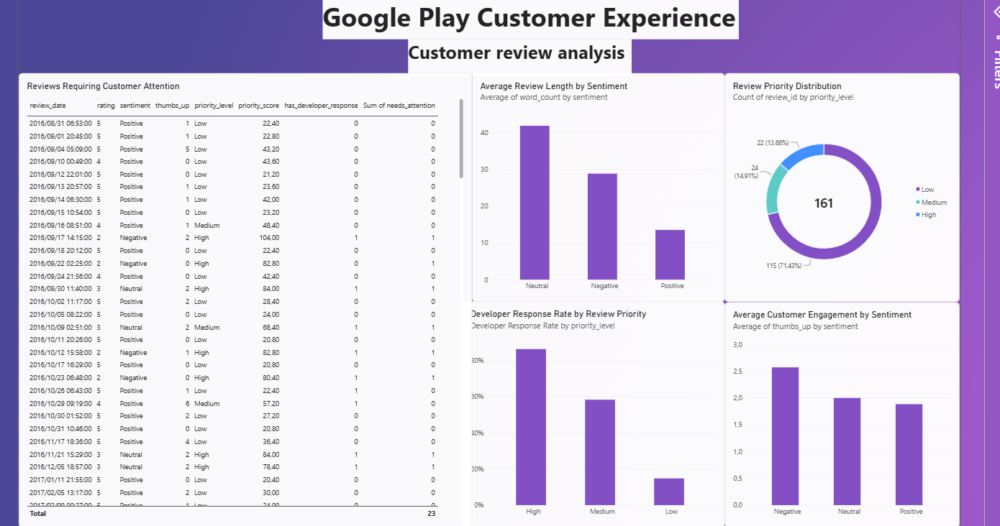

# Google Play Customer Experience Analysis

## About this project

I created this project to practise using data science on a customer
experience problem. I used Google Play review data to examine customer
ratings, review behaviour and how often the developer responds to users.

The main question I wanted to answer was:

**How can a company use app reviews to understand unhappy customers and
improve the way it responds to reviews?**

I went beyond basic data analysis by adding feature engineering,
comparing two machine learning models, evaluating the selected model and
building a three-page Power BI dashboard to communicate the results.

## What I did

I first checked the dataset for missing values, duplicates and incorrect
data types. I then cleaned the dates and created new features such as
sentiment, review word count, review length groups, engagement groups,
response delay, review month and year, and a simple priority score for
reviews that may need attention.

One important cleaning decision was not to delete reviews with no
developer response. In this project, no response is useful information
because it shows that the developer did not reply.

The project follows this workflow:

**Business problem → Data cleaning → Feature engineering → Exploratory
analysis → Machine learning → Model evaluation → Power BI dashboard →
Business insights**

## Business findings

The dataset contains **161 reviews**. The developer responded to about
**31%** of the reviews.

Lower-rated reviews were much more likely to receive a developer
response than 5-star reviews. This suggests that the developer mainly
focuses on users who are unhappy or experiencing problems.

I also found lower-rated reviews that did not receive a response. I
treated these as possible missed opportunities for the company to assist
customers.

Response times are widely spread and include unusual values, so I used
the **median response delay** together with response-time groups rather
than relying only on the average.

The dashboard also shows differences in review length, customer
engagement and developer response behaviour across sentiment and
review-priority groups.

## Machine learning

I built a classification model to predict whether a developer would
respond to a review.

I compared:

-   Logistic Regression
-   Random Forest

I used **5-fold stratified cross-validation** because the dataset is
small and I wanted a more reliable comparison than using only one
train/test split.

  Model                   Accuracy   Precision   Recall      F1   ROC-AUC
  --------------------- ---------- ----------- -------- ------- ---------
  Logistic Regression        0.826       0.721    0.780   0.738     0.917
  Random Forest              0.814       0.753    0.620   0.667     0.896

Logistic Regression performed better overall, especially on ROC-AUC and
recall, so I selected it as the final model.

I made sure not to use developer response dates, response delays or
response text as model inputs because these would give the model
information about the answer it is trying to predict.

Because the dataset is small, I treat this model as an exploratory
demonstration rather than a production-ready system.

## Power BI Dashboard

I built a three-page Power BI dashboard to turn the analysis into an
interactive customer-experience report. The `.pbix` file is included in
the `powerbi` folder.

### 1. Executive Overview

This page gives a high-level view of review volume, developer response
rate, median response delay, unanswered attention reviews, customer
ratings, sentiment and review trends over time.



### 2. Customer Review Analysis

This page explores review priority, review length, customer engagement
and developer response rates across priority levels. It also includes a
review-level table for identifying reviews that may require attention.



### 3. Developer Response & Model Analysis

This page connects the customer-response analysis to the machine
learning results. It shows developer response status, response-time
distribution, response rate by sentiment, actual versus predicted
response behaviour, model KPIs and the ROC-AUC comparison between
Logistic Regression and Random Forest.


## Repository structure

``` text
google-play-customer-experience-analysis/
├── data/
│   ├── raw/
│   │   └── README.md
│   └── processed/
│       └── google_play_reviews_cleaned.csv
├── images/
│   ├── executive_overview.png
│   ├── customer_review_analysis.png
│   └── response_model_analysis.png
├── models/
│   └── developer_response_logistic_regression.joblib
├── notebooks/
│   └── Google_Play_Customer_Experience_Analysis.ipynb
├── outputs/
│   └── model_comparison.csv
├── powerbi/
│   ├── Google_Play_Customer_Experience_Dashboard.pbix
│   ├── google_play_reviews_powerbi.csv
│   ├── sentiment_summary.csv
│   └── yearly_summary.csv
├── .gitignore
├── README.md
└── requirements.txt
```

## How to run the project

1.  Clone or download this repository.
2.  Install the packages listed in `requirements.txt`.
3.  Open `notebooks/Google_Play_Customer_Experience_Analysis.ipynb` in
    Jupyter Notebook or JupyterLab.
4.  Run the notebook cells in order to reproduce the analysis and
    modelling workflow.
5.  To explore the dashboard, open
    `powerbi/Google_Play_Customer_Experience_Dashboard.pbix` in Power BI
    Desktop.

The processed CSV files used by the Power BI report are also included in
the `powerbi` folder.

## Limitations

This is a small dataset with only **161 reviews**, so I would not treat
the model as a production model. Most ratings are positive, which means
the classes are not perfectly balanced. The results are useful for
exploring the problem and demonstrating the data science process, but
more data would be needed before a company could rely on the model in
practice.

The analysis is also based on the information available in the review
dataset. It cannot explain every reason why a developer chose to respond
or not respond.

## Skills used

Python, pandas, NumPy, data cleaning, feature engineering, exploratory
data analysis, text features, TF-IDF, Logistic Regression, Random
Forest, stratified cross-validation, classification metrics, model
interpretation, Power BI and dashboard design.
